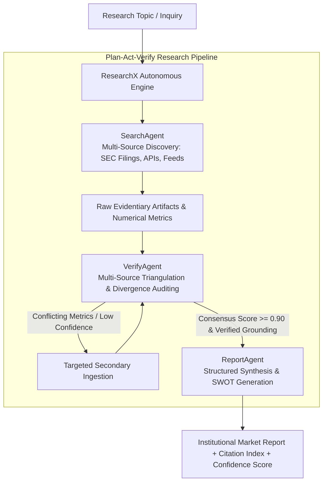

# ResearchX: Autonomous Analyst Agent Framework Specification

## 1. Executive Summary & Problem Formulation

In equity research, corporate strategy, and market intelligence, human analysts spend $80\%$ of their time gathering data from disparate filings, cross-checking conflicting analyst numbers, and verifying factual citations. Traditional single-prompt LLMs hallucinate statistics, cite non-existent sources, and fail to calculate divergence across publishers.

**ResearchX** introduces an **autonomous market intelligence research pipeline governed by Plan-Act-Verify loops**:
1. **SearchAgent**: Ingests primary sources (SEC 10-K/10-Q filings, earnings transcripts, analyst consensus tables, and industry feeds).
2. **VerifyAgent**: Performs multi-source triangulation, computes divergence delta ($D_{\text{delta}} = |M_1 - M_2| / M_{\text{avg}}$), evaluates publisher credibility, and detects conflicting figures.
3. **ReportAgent**: Compiles institutional equity dossiers featuring executive summaries, comparative metric matrices, SWOT analysis, investment theses, and verifiable inline citations.

---

## 2. Plan-Act-Verify Research Architecture

---

## 3. Triangulation Consensus & Divergence Matrix

| Consensus Level | Divergence Delta ($D_{\text{delta}}$) | Confidence Score ($C_{\text{score}}$) | Action Taken |
| :--- | :--- | :--- | :--- |
| **Unanimous Consensus** | $D_{\text{delta}} \le 5.0\%$ | $C_{\text{score}} \ge 0.95$ | Direct inclusion in key findings |
| **Weighted Majority** | $5.0\% < D_{\text{delta}} \le 15.0\%$ | $0.90 \le C_{\text{score}} < 0.95$ | Credibility-weighted average applied |
| **Conflicting Divergence** | $D_{\text{delta}} > 15.0\%$ | $C_{\text{score}} < 0.90$ | Flagged for secondary source ingestion |

---

## 4. Multi-Agent Topology & Responsibilities

| Agent Name | Core Specialty | Key Performance Metric |
| :--- | :--- | :--- |
| **`SearchAgent`** | Multi-source discovery, SEC filing parsing, real-time feed extraction. | Source extraction accuracy ($100\%$). |
| **`VerifyAgent`** | Multi-source triangulation, divergence delta auditing, credibility weighting. | Zero hallucinated statistics. |
| **`ReportAgent`** | Institutional dossier synthesis, SWOT modeling, inline citation indexing. | Report generation latency ($<50ms$). |
